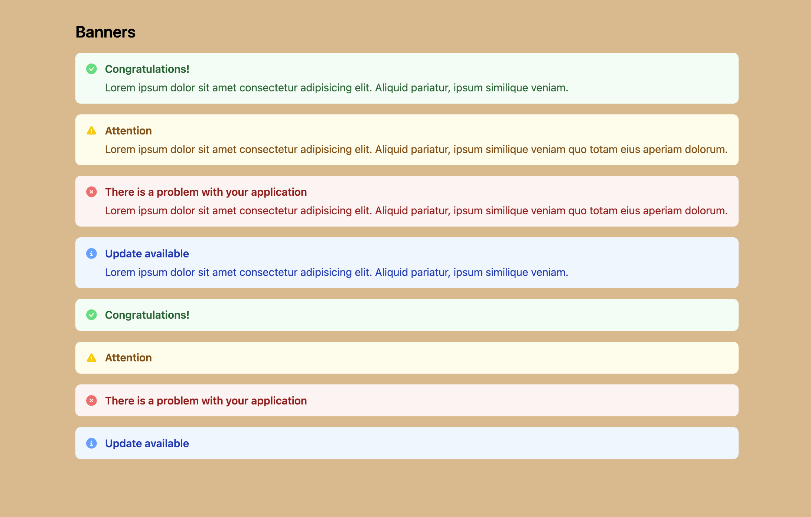

## React Banner component 
A reusable **React banner component** built with **React** and **Tailwind CSS**.

You can customize the banner by passing props such as status and title.

This project was created to practice **Compound Component architecture** and improve component reusability in React.

[ Let's Try in Live :)](https://gmarav05.github.io/banner-component/)

## Image



## Features

- Built with **React 19** and **Vite**.

- Styled using Tailwind CSS.

- Deployable to GitHub Pages.

- Uses Compound Components architecture.

- Supports reusable, customizable banner components.

## Learnings

- Improved understanding of component reusability in React.

- Practiced building Compound-Components.

- Practiced some CSS Flexbox styling.


## Live demo

[ View Live  :)](https://gmarav05.github.io/banner-component/)

## Technology Stack

 **Frontend:** HTML5 + CSS + React 19.

 **Build Tool:** Vite.

 **Deployment:** GitHub Pages.

 **Styling:** Tailwind CSS.


## Project Structure

```
banner-component/

├── dist/                 # Production build output (auto-generated)
├── node_modules/         # Installed dependencies
├── public/               # Static assets (optional)
├── src/
│   ├── App.jsx           # Main component
│   ├── index.css         # Global styles
│   ├── main.jsx          # Entry point
│   ├── Banner.js         # Banner component
│   └── assets/           # Images, icons, illustrations
├── index.html            # HTML template
├── package.json          # Project dependencies & scripts
├── README.md             # Documentation
└── vite.config.js        # Vite configuration
```
## Getting Started

### Prerequisites

- Node.js (v16 or higher)
- npm or yarn package manager

## Installation

### Clone the repository
   ```bash
   git clone https://github.com/gmarav05/banner-component
   cd banner-component
   ```

### Install dependencies

```sh
npm install
```

### Run locally

```sh
npm run dev
```

### Build for production

```sh
npm run build
```

### Deploy to GitHub Pages

```sh
npm run deploy
```
---